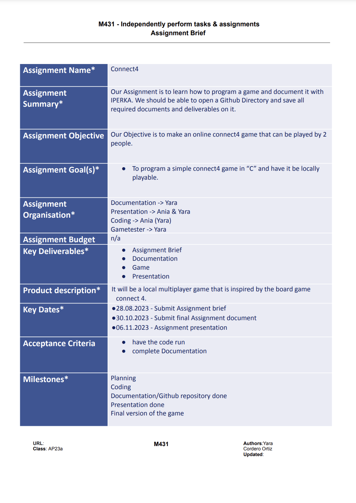

# Informing 

 

## Collecting Information

The first thing we did was getting into groups and deciding what kind of programming project we wanted to do.

 

## Informing if we can implement this project

We first informed us how our game would be programmed and in which coding language it would be best written in. We also asked our teacher if we can implement our idea, which he said yes to. 

 

## SMART-Goals

<ul>
  <li>Program a simple game in C based on the boardgame connect4, until the 30th of October.</li>
  <li>Have all needed Documentation, like Informing, Planning, Decision, Realization, Control and Assesment ready until the due date (30.10.23)</li>
</ul>

 

## Assignment Brief

This is our Assignment Brief, it contains all our important facts for our project.

 

## Resources

<ul>
<li>Google</li>
  Was used to find explanations and solutions to problems.
<li>ChatGPT</li>
  We based some of our code of an AI generated code. (all code copied from AI, found marked in code)
  (https://chat.openai.com/share/543524f0-3cf0-447a-8de0-4cc793bb95f8)
<li>Documents from Neil Devlin</li>
<li>YouTube</li>
  Used for test-case (link to video in Controlling-Dokument)
</ul>

 

## Tools 

<ul>
  <li>Visual Studio Code</li>
  We used this to code our game and to compile it.
  <li>Command Prompt Window</li>
  Here we play and tested the game.
</ul>

 

[back to README](README.md)

