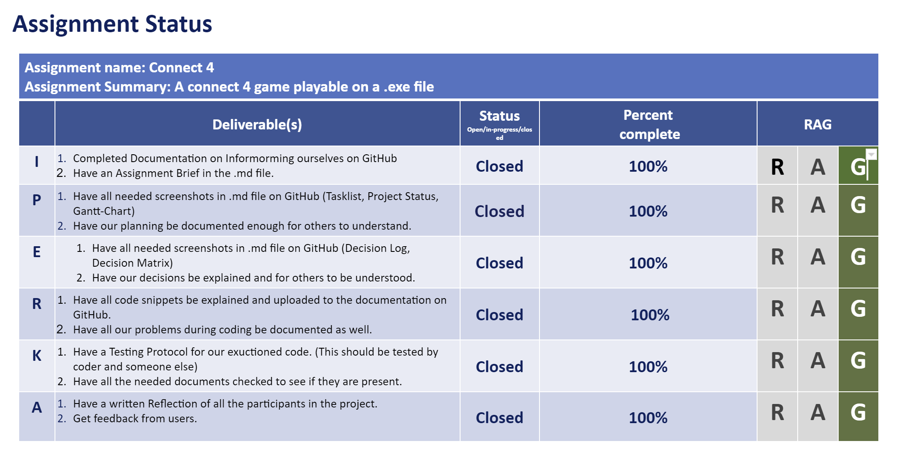

# Planning 

 

## Resource plan

This is how we found out how much time we have available to work on our assignment. 

Yara had 50 hours available.

Ania had 60 hours available.

In total we had 110 hours to work on our Assignment.

 

## Milestones

<ul>
  <li>Finish our Informing-Documentation - 01.10.23</li>
  <li>Finish our Planning-Documentation  - 08.10.23</li>
  <li>Finish our Decision-Documentation  - 07.10.23</li>
  <li>Finish our Coding in C & Dokumentation - 20.10.23</li>
  <li>Finish our Access & Controll-Dokumentation - 23.10.23</li>
</ul>

## Assignment status

The project status document helps with seeing what has been done, and what is still in progress at the moment

 

## Tasklist

We split up all needed tasks and when it has to be finished. This makes it clearer who does what and when it has to be done.

 

## Milestone (Gantt-Chart)

We made a detailed GANTT so we could plan what due dates for specific thiings we wanted. This is a very visual way to 

 

[back to README](README.md)
