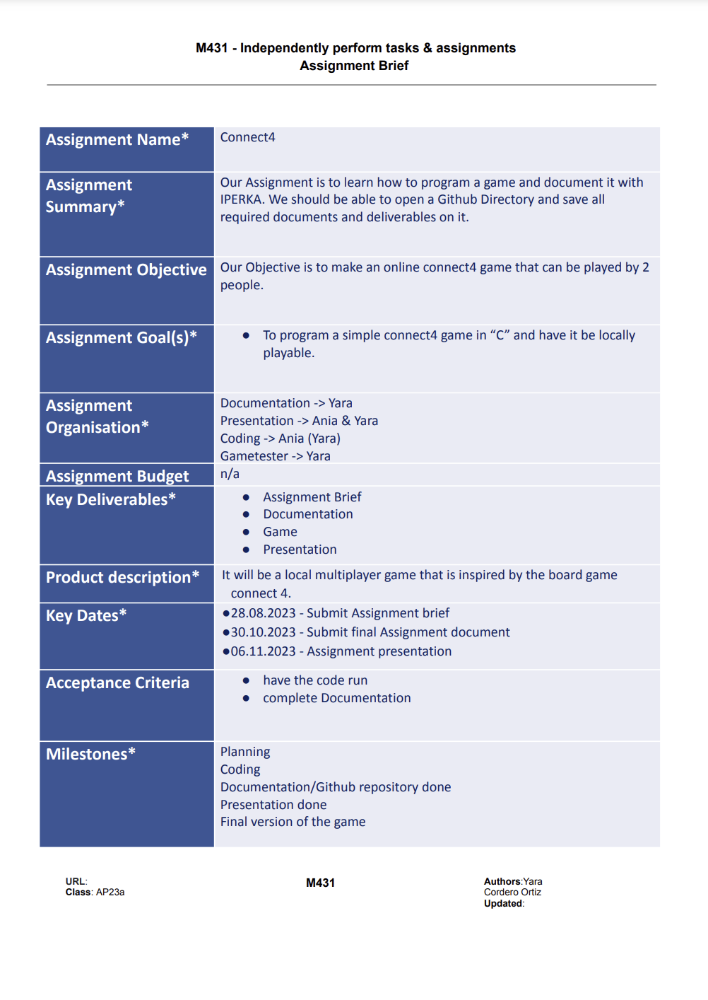

# Planing 

<uli><li>We first filled out our Assignment Brief where we wrote down all our imnportant infos about our project.<uli><li>
 
 
 

### Assignment Brief 

This is our Assignment Brief, it contains all our important facts for our project.

 
 
 

### Projects status

The project status document helps with seeing what has been done, and what is still in progress at the moment

 
 
 

### Tasklist

We split up all needed tasks and when it has to be finished. This makes it clearer who does what and when it has to be done.

