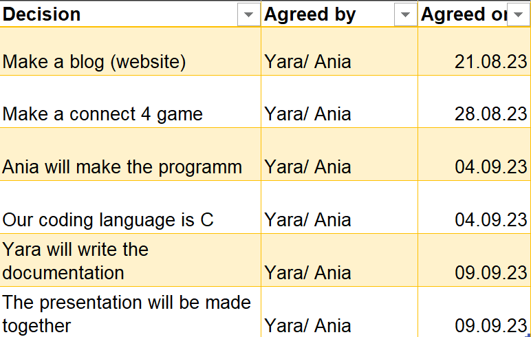
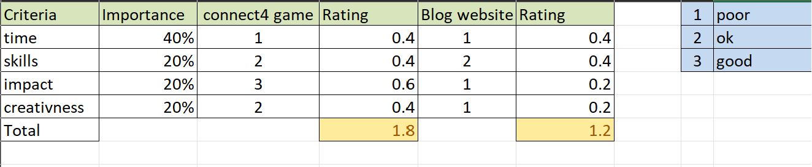

# Evaluating/Deciding

## Decision Log

This the Decision Log. We logged everytime we made an important decision regarding our project.

## Decision Matrix

At first we wanted to make a blog (website) but decide against it after comparing another possible project we could do. The decision matrix was really helpful to realize what criterias were important to us.

## Criterias 
<ul>
<li>Time</li>
<pi>Time was the most important factor for us, since we knew we where going to be tight on time.</pi>
<li>Skills</li>
<pi>What we had imagined to be our skills, was what prior knownledge we had with the programm or the programming language we would code it in.</pi>
<li>Impact</li>
<pi>This is what at the end would be more impressive and get us a better grade.</pi>
<li>Creativness</li>
<pi>This our criteria on how creative we imagined our project for us to be.</pi>
</ul>

 

[back to README](README.md)
